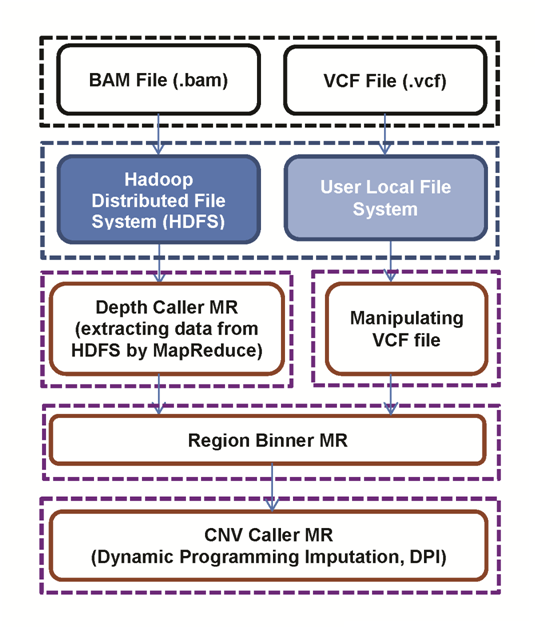

# HadoopCNV

## Introduction

HadoopCNV (internal codename: PennCNV3) is a Java implementation of MapReduce-based copy number variation caller for next-generation whole-genome sequencing data.

In addition to single nucleotide variants (SNVs) and small insertions or deletions (INDELs), whole-genome sequencing (WGS) data may also be used to identify large-scale alterations, such as copy number variations (CNVs) and other types of structural variants (SVs).  Existing CNV detection methods mostly rely on read depth or paired end distance or the combination thereof.  Additionally, resolving small regions in WGS samples with deep coverage can be very time consuming due to massive I/O cost. To facilitate the CNV detection from WGS data, we developed HadoopCNV, a Dynamic Programming Imputation based algorithm, which infers detects aberration events such as copy number changes through information encoded in both allelic and overall read depth.  Our implementation is built on the Hadoop MapReduce paradigm, enabling parallel multiple processors at multiple nodes to efficiently process separate genomic regions in tandem. Extensive benchmarking studies on real and simulated data demonstrated that HadoopCNV has a comparable or better performance than leading CNV callers for WGS data. Additionally, HadoopCNV on a 32-node cluster requires only 1.6 hours for a human genome with 30X coverage, making rapid analysis on thousands of genomes feasible.

## Setup

To setup the environment for HadoopCNV, you need to install Hadoop2.0+ in your computer or cluster first. Please refer to [Initialization](docs/initialization.md)

## Example

After initialization, to run HadoopCNV, please check our example first:
[Example](docs/example.md)

## Run

You need a **VCF** file and a **BAM** file to call CNVs from your sample. 

1) **VCF**: Should be in your local hard drive. You need to check GATK or Samtools or any small variant calling tool for your sampl.

2) **BAM**: Should be in HDFS. This is the alignment file for your sequencing sample.

In general, after you compile HadoopCNV succesfully and setup your Hadoop environment, it is very easy to run it:

1) Put the BAM file in HDFS and VCF file in your local file system. In **config.txt**, set the correct path for **BAM_FILE** and **VCF_FILE**.

NOTICE: Sometimes you have your individual BAM files for each individual chromosome. You can use a '\*' to include many BAM files.

For example, my NA12878 BAM file name is in the 'NA12878.chrom\*.ILLUMINA.bwa.CEU.high_coverage.20100311.bam' format. The '\*' can refer to any character. Thus there is no need to merge your BAM files first anymore.

2) In general, there is no need to change any other parameters in the config.txt file. 

In case you want to change anything, the only parameters you should play with are 'ABBERATION_PENALTY' and 'TRANSITION_PENALTY'. Increase 'ABBERATION_PENALTY' to make CNV calls more stringent. Increase 'TRANSITION_PENALTY' to make only longer calls to be considered.

3) Please notice as HadoopCNV collects read depth information through BAM files, any uncovered region will be neglected. To solve this problem, we made a baseline BAM file to make sure all valid genomic regions (excluding 'N') are covered: 'hg19.bam.extra'.

For example, if your file is called 'NA12878.chrom\*.ILLUMINA.bwa.CEU.high_coverage.20100311.bam', you should change 'hg19.bam.extra' to 'NA12878.chrom.ILLUMINA.bwa.CEU.high_coverage.20100311.bam.extra', and change 'BAM_FILE' parameter in your config.txt to 'NA12878.chrom\*.ILLUMINA.bwa.CEU.high_coverage.20100311.bam.\*'. Then this additional file is automatically included.

For hg38 or other genomes, we provided a python script **preprocessBAM.py** to generate this baseline BAM file from FASTA files.

First put all fasta files of a specific genome into a folder `./fasta`

Then run this script by `python preprocessBAM.py <prefix> ./fasta`. A SAM file will be generated as '<prefix>.extra.sam'.
Then use [Samtools](http://www.htslib.org/) to transform it to BAM file by: 

`samtools -t fasta/chrall.fa.fai <prefix>.extra.sam > NA12878.chrom.ILLUMINA.bwa.CEU.high_coverage.20100311.bam.extra`

NOTICE: <prefix> can be any name you give to the file. 'fasta/chrall.fa.fai' is the fasta index associated with all chromosomes. 

If you don't have this file in your './fasta' dir, please first concatenate all fasta files into one:

`cat ./fasta/*.fa > ./fasta/chrall.fa`

Then use Samtools to generate index:

`samtools faidx ./fasta/chrall.fa`

3) After all above is done, just run by `./run.sh`

4) To run many samples in a sequencial pipeline, please see our example `run_all.pl`. The idea is to use `sed` to change parameters each time.

## Workflow

## Reference

Yang H, Chen G, Lima L, Fang H, Jimenez L, Li M, Lyon GJ, He M, Wang K. HadoopCNV: A dynamic programming imputation algorithm to detect copy number variants from sequencing data

## License

[WGLab MIT License](http://wglab.mit-license.org) is used for HadoopCNV.
